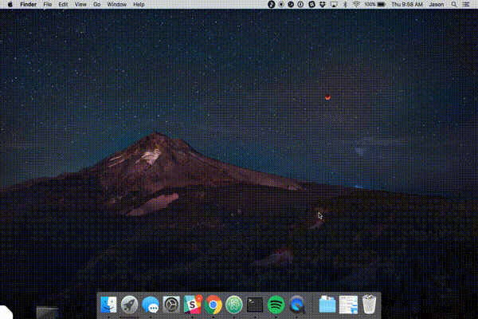

## WSGE Tracks

An prototype [Electron](http://electron.atom.io/) menubar app that shows the playlist for the WSGE radio station, and shows notifications for new songs.

This app polls the WSGE playlist for new songs, and uses the [Spotify API](https://developer.spotify.com/web-api/) to get a Spotify uri, which opens the Spotify desktop app to that track/record.

### Screenshots

The playlist view, accessible from the menubar:

Simple notifications:

Notification clicks open Spotify:

